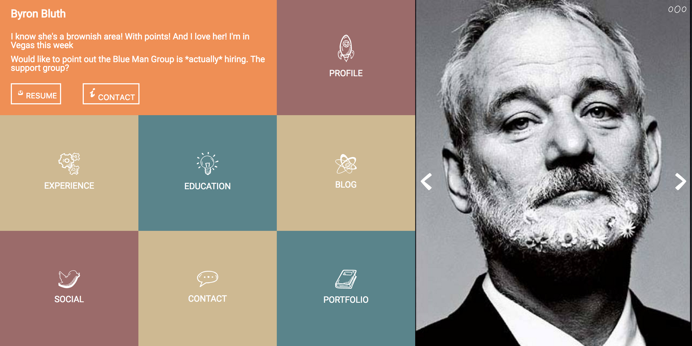

### Laura Turk Comp Challenge 1

##### A static comp challenge from the 1701 Front End program at Turing School for Software and Design. Site is responsive, though no links are included to additional information.

###### Color palette inspired by Arrested Development

###### icons from Captain Icon have CC licence with Attribution - ShareAlike (CC BY-SA).

###### and free hand drawn icons from [Good Stuff No Nonsense](goodstuffnononsense.com)

###### bluth ipsum and [Fill Murray](fillmurray.com) images

